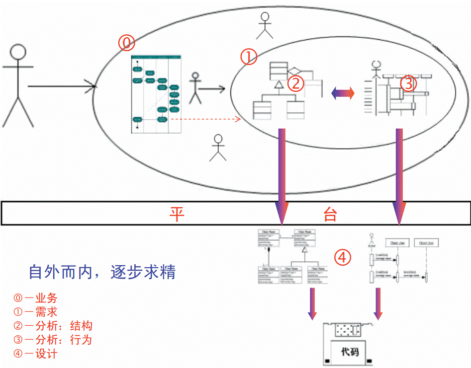
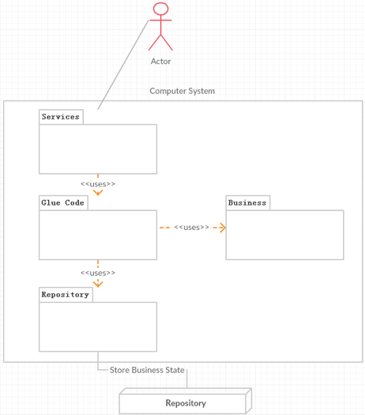
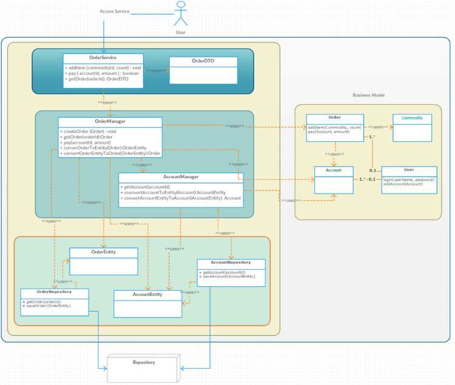

心理基础
--------

本我：无意识

自我：潜意识

超我：教练（OB）视角，对话自我，反思过去和计划未来

### 认识
<table>
    <thead><th></th><th>本我 – 观察</th><th>自我 – 加工</th><th>超我 – 质检</th></thead>
    <tbody>
        <tr>
            <td>抽象、演绎</td>
            <td></td>
            <td></td>
            <td>
素材：依赖直接的感知, 过滤间接的感知，审视注入的成见 
归因：关注样本数量, 时间跨度, 自身关联性, 主次因素  
警惕：小样本（自利、单因素、无因果并存、短期），先入为主（政治、世俗注入），大概率非必然（一棍子打死）
            </td>
        </tr>
        <tr>
            <td>推理、创造</td>
            <td></td>
            <td></td>
            <td>
分解：按关联程度分解，模块对外呈现抽象接口（稳定），对内封装具体实现（被隔离） 
泛型：正反向推理、反证、排除、谓词、穷举 
类比：通过记忆或联想解决问题 
比喻：化未知为已知，化抽象为形象，例如UML  警惕：忽视其他可能性，充分条件与必然条件
            </td>
        </tr>
        <tr>
            <td>记忆</td>
            <td></td>
            <td></td>
            <td>
结构：多级，类似ROM、CPU缓存、内存、硬盘 
生活：三观 –》习惯，思维方法–》常识 –》照片，随笔，书籍 
编程：本文 –》常用技能 –》知识纲要，代码库（通用模块，项目模板）–》参考资料（书籍、文章），参考项目  
思绪：便签
            </td>
        </tr>
    </tbody>
</table>

### 情感

<table>
    <thead><th></th><th>本我 – 本能</th><th>自我 – 成见</th><th>超我 – 原则</th></thead>
    <tbody>
        <tr>
            <td>基础</td>
            <td>身体感觉 </td>
            <td>安全感、幸福感</td>
            <td>自信感、透视本质与核心价值</td>
        </tr>
        <tr>
            <td>倾向</td>
            <td>从疲劳到休息，从无聊到刺激</td>
            <td>
占有欲、道德感、 集体归属感（尊重、友爱、欺压、 攀比虚荣，陌生防御，政治倾向）、 成就感（创造与毁灭，知难而退）、美感</td>
            <td>
基础：做有乐趣并且能维持生活的工作，承担起家庭的责任，对物质需求要知足常乐 
社会：诚信和控制距离能让合作变得简单，政治是少数人的游戏 
充实：良性的亲情友情，漫游（旅行、虚拟世界），身体的活力
            </td>
        </tr>
    </tbody>
</table>

### 行为

|      | **本我 - 基础**            | **自我 - 主导**                                    | **超我 - 引导**              |
|------|----------------------------|----------------------------------------------------|------------------------------|
| 基础 | 条件反射、体力脑力作息节奏 | 情感沉淀、情绪惯性、行为思维惯性，外部刺激、约束   | 跳出环境、对话自己、透视本质 |
| 倾向 | 贪（吃、睡…）              | 逃避阴暗（失败、丧失），沉迷虚拟世界（游戏、影视） | 见“方法”                     |

思维方法
--------

### 动机（值不值得做）

透视本质：看清本质的需求和本质的服务

判断价值：喜欢/需要/适合; 投资与回报

警惕：成见、片面、不考虑后果，冲动

### 目标（做成什么样）

认知模型：感官/理解/交互

业务逻辑：交互流程（信息、资源的输入输出，加工路径）

警惕：认知不流畅，流程不全面，接口不精确

### 计划（怎么做-框架）

设计方案：可行性分析，原型实验

划分阶段：逐步消除风险（沟通、复杂、抽象、新事物）

分解任务：降低思维难度，按关联程度将问题分块分层分工，依赖抽象接口

警惕：复杂问题三思而后行，无风险意识导致的返工、无用功，模块耦合度大、接口不抽象

### 执行（怎么做-细节）

方法思路：依据体力脑力能实现的步骤、方法

用脑节奏：专注，反思（跳出定势），休息

-   创造环境：选择清静、单调的环境，设置免打扰

-   划分时段：自我专注1-2小时，跳出自我，反思感悟10-30分钟

-   难点预警：分时段多次设计和审核，考虑多种方案和方案全面性，参考多种渠道资源

-   场景预警：警惕与问题逻辑、环境习惯、认知过程（例如开头难）相关的常见缺陷

-   状态预警：当情绪起伏、精力不足，暂时搁置、睡觉

结果应变：沟通反思，修正目标、计划

警惕：蛮干，无法自拔

工程管理
--------

总目标：

-   团队的稳定性在于责权平衡，健壮性在于责任交叉，高效性在于目标明确、奖罚分明

-   软件的创造过程可能模糊和复杂，需要不断的实践来探索和修正，开发人员和客户之间、开发团队内部，都必须围绕简洁的沟通和频繁的测试，持续完善

### 企业文化

目标：严谨务实、积极进取

方案：深入客户、透视需求，建立人才库、知识库和赏金制度

警惕：无学习和探讨的氛围，低效加班，绩效大锅饭，项目结束定奖金

### 迭代产品

目标：宏观上逐步消除风险

方案：

-   风险识别：需求理解不准确，模块设计不抽象，质量检测不精确

-   阶段规划：从原型产品到最终产品，从核心功能到扩展功能，从功能可用到功能好用

-   进度监测：统计全局、阶段、个人的速度与状态，以当前速度推测和调整

警惕：严重偏离客户需求，导致大量返工；凭感觉制定计划，影响工作积极性；测试不严谨，陷入bug泥潭；复杂问题、核心问题设计草率，导致流程复杂，模块耦合度高，扩展和维护成本高

### 分工合作

目标：建立职责明确、并行高效、结构稳定的团队合作交互流程与平台

方案：

-   衡量能力：责任感、悟性、合作、专注、知识库

-   划分角色：客户、产品经理、测试、工程与售后服务；开发经理、开发

-   流程环节：划分、分配、执行、审核

-   开发步骤：理解动机、业务调研、方案设计，需求分析、软硬件实现，实施与运营

-   业务事件：查看、提交；提问、批注、求助、分享、讨论、重构、总结、登记工时

警惕：分配时任务完成的标准不清晰，导致功能理解分歧，逻辑不严谨；分配时同一任务没有多人交叉负责，导致设计质量低，复用率低，维护性低，知识分享差；角色固化，导致人员不能充分利用，各角色间不能互相体谅、接口不精确抽象

### 执行平台

目标：设计核心流程的公司视图、团队视图、个人视图

方案：

   公司视图：项目概览

-   立项：业务调研，设计方案，分析可行性

-   规划：组建团队，划分阶段，奖罚标准

-   状态：当前阶段，风险

   团队视图：里程碑与版本

-   划分任务：分解任务，分配任务，提供完成任务的思路与模板

-   查看产品：版本、指标、目标、系统与模块任务（具体的产品设计）

-   查看过程：任务流程状态、任务执行阶段、触发事件

   个人视图：任务

-   任务：来源、输入、输出、规划（步骤、时间、模板）、状态

-   执行：时段、计划、演绎、反思，部署新计划、结果

-   领悟：思绪、知识库

警惕：仅有缺陷管理、周报的平台，缺少其他流程的平台，缺少整体展示各视图的平台

逻辑建模
--------

总目标：通过封装和抽象，分解从想法到产品的复杂度

总方案：上层决定下层，下层提供可行性约束，层次以抽象接口形式存在

警惕：

-   各步骤职责的核心理解不准确，接口描述不清晰；寄希望通过文档模板（或者项目管理软件）解决所有问题

-   缺少从人的思维能力、思维过程出发看问题，缺少务实总结、大胆尝试、持续优化

### 业务：为什么做

原则：为客户创造价值才能为自己创造价值

方案：以业务流程为基础，透视本质的技术、需求、服务

-   捕捉动机：发现问题场景，描述业务流程、成功指标、用户数量、投资意向

-   依赖资源：输入输出、运算、存储、通信, 技术积累

-   设计方案：细分用户，设计新业务流程、定义产品功能, 技术验证

-   市场分析：竞争环境、市场时机、营销策略, 估算成本与回报

警惕：

-   仅调研客户中的领导角色

-   看不透客户表面的要求，抓不住问题核心，设计不出优秀的方案

-   被动客服，不主动深入调研使用反馈，积极完善

### 需求：做成什么样

原则：逻辑严谨、操作简洁、界面美观

方案：感知理解信息、执行步骤完成目标

-   描述交互步骤：通过用例描述产品与边界交互, 以时序图和类图为主, 状态图辅助

-   制作交互原型：作为评审依据，降低沟通误差

-   设计测试数据：作为用例的操作说明和验收标准

警惕：

-   闭门造车，面向开发人员设计产品，而不是面向最终客户

-   测试人员未参与到需求分析，开发和测试人员依赖的用例没有统一

-   没有频繁的迭代反馈

-   不重视面向测试人员开发测试和部署工具

### 设计：怎么做-框架

原则：逐步抽象、控制风险、重用资源

方案：

-   分解用例实现：依据逻辑耦合度和复杂度，将逻辑分解成对象逻辑树, 以类图、时序图为主，状态图辅助，典型用例如下

> Service就专注于user的需求，并组合Glue Code提供的服务完成需求。
>
> Glue Code专注于组合business的调用，管理Business里面对象的生命周期，并且通过Repository保存或加载Business的状态
>
> Business专注于实现业务的核心模型。
>
> Repository专注于数据的保存，并和存储设备一一对应。
>
> 以上只是针对典型用例的分析，在逻辑复杂的情况下，用例逻辑可以划分成多个模块，每个模块的下一级都可以认为是Repository，每个模块的上一级都可以认为是User；在逻辑简单的情况下，用例中的单元是可以进行合并的。

-   抽象对象实例：对各用例中的对象及成员进行抽象, 形成类型，领域以及领域间概要关联, 通过继承/包含/泛型实现对象间公用

-   生成实现框架：依据类型/领域复杂度，生成层与组件；依据性能指标，选择部署方式和相关组件；选择已有通用组件（工具类/SDK类）；创建代码目录，明确编程规范；

-   编写核心代码：核心业务逻辑，典型模块，难点模块，风险大的模块

### 实现：怎么做-细节

方案：

   编码

-   从上而下：从上层（外部服务）接口到单元测试（未养成习惯），再到伪代码，再到主要代码，再到下层接口，此处递归，最后从上而下补充次要代码

-   透视规范：母语命名、首字母识别用途

-   代码自查：复读复杂逻辑, 过滤常见异常

   调试

-   工程日志：边界的输入输出，包括异常

-   开发日志：主要接口(时序/状态)日志, 异常

-   检测代码覆盖率：通过单元测试工具(未形成习惯)

-   通用访问：开放核心对象的实时状态访问

   定位异常

-   信息来源：观察到的现象，工程日志, 开发日志，系统日志，断点调试，通用访问

-   分析日志：定位异常, 定位时间，定位功能、定位设计、定位代码

-   挖掘异常：验证测试用例设计的全面性，分析并归纳到常见异常表(非预期的交互顺序；边界非法输入；内存泄露; 非预期的多线程并发顺序)
